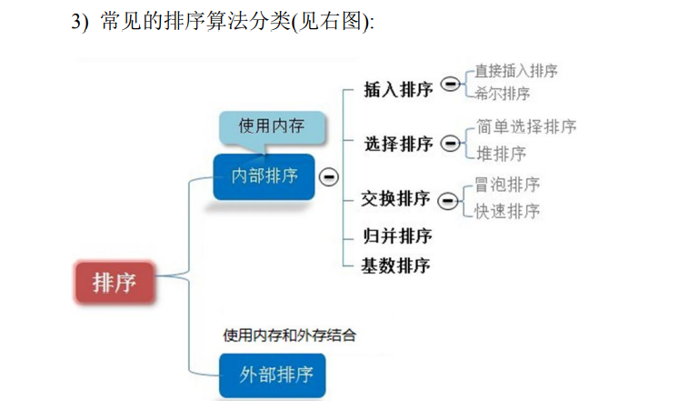

# 排序算法的分类
按照是否需要借助外部存储设备 ,分为 内部排序,和外部排序
其中内部排序 又分为五种排序类型
交换排序 : 冒泡排序, 快速排序
选择排序: 简单选择排序, 堆排序
插入排序: 简单插入排序, 希尔排序
基数排序
归并排序

# 时间频度
一个算法中语句的执行次数叫做 时间频度 记住 T(n)
有一个辅助函数f(n) 使得 在n -> 无穷大的时候, T(n)/f(n) = 常数
此时称f(n)  为 T(n) 的同数量级函数
记作 T(n) = O(f(n)) 称 O(f(n)) 为算法的时间复杂度

根据时间频度T(n) 计算对应的算法的 时间复杂度
T(n) = 2n^2 + 7*n + 6 
1.去掉低阶项
2.去掉高阶项的系数 
T(n) = O(n^2)

常见的时间复杂度:
1.常数阶 O(1)
2.对数阶 O(log2 n)
3.线性阶O(n)
4.对数线性阶O(log2n *n)
5.平方阶 O(n^2)
6.立方阶O(n^3)
7.指数阶O(2^n)

在做算法分析的时候,主要讨论的就是时间复杂度
一些缓存产品和算法(基数排序) 的本质就是拿 空间(内存空间)换时间

# 冒泡排序

